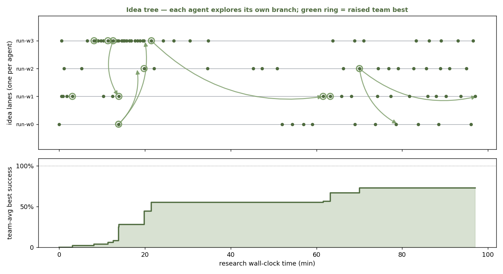
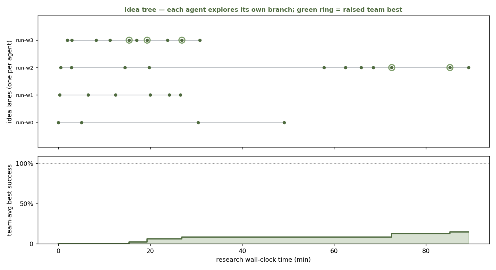

# ENPIRE (sim reproduction)

A simulation-only reproduction of the ENPIRE physical-autoresearch pipeline
(EN → PI → R → E) on the **Push-T** task — no real robots. A "robot station" is a
`gym-pusht` sim instance; the fleet is N such instances driven by N coding agents in
N git worktrees.

Paper: *ENPIRE: Agentic Robot Policy Self-Improvement in the Real World* (NVIDIA / CMU /
UC Berkeley, 2026). See [`PLAN.md`](PLAN.md) for the full build plan and stage map.

## Status

The full pipeline (EN → PI → R → E + reproduction plots) is **built, tested, and run
end-to-end with real coding agents** (see [Results](#results) below).

- **Stage 0 (EN + R) — done.** Env interface, parallel rollout/eval, video+results
  logging. Recovered CEM baseline validated at **96% success (48/50)** over 50 episodes.
- **Stage 1 (PI) — built.** Autoresearch loop helper (`agents/coding_agent.py`) + agent
  protocol (`configs/task_pusht.md`). Weak editable stub in `policies/policy.py`.
- **Stage 2 (E) — built.** Git-worktree fleet (`agents/fleet.py`), evolution / cross-agent
  recipe sharing (`agents/evolution.py`), orchestration entry (`run_fleet.py`).
- **Stage 3 — built & verified.** `metrics/idea_tree.py` (Figure 1: idea tree + team
  hillclimb + cross-agent curves) and `metrics/plots.py` (single-lane hillclimb). Validated
  against synthetic multi-lane data.

The coding agents are launched by a Claude Code session spawning one subagent per station
(homogeneous Claude fleet; Codex backend available but deferred to the cross-agent
comparison).

## Results

Real runs of the fleet (4 Claude coding agents, leakage-safe worktrees, writing Push-T
policies from scratch). The figures are `metrics/idea_tree.py` output: **idea tree on top**
(one lane per agent, dots = ideas tried, green ring = raised team best, green arrows =
cross-agent recipe adoptions) and **team hillclimb on the bottom** (best success vs
research wall-clock).

**Collaborative run** — agents `peek` at a shared leaderboard and `adopt` a peer's recipe
when stalled. 6 adoptions; the winning CEM-MPC recipe spreads across lanes.



**Isolated run** (no collaboration) — 4 independent lanes, **no cross-agent arrows**, lower
team climb. Shown for contrast: collaboration is what produces the branching structure.



| Run | Cross-agent adoptions | Team-avg best (12-seed) | Best validated (held-out) |
|---|---|---|---|
| Isolated  | 0 | 14.6% | 20% |
| Collaborative | 6 | 72.9% | **~50%** |

**Honesty note — the gap between the two right columns is the headline finding.** The
12-seed leaderboard numbers (used live by the agents) are **gameable**: the eval reused a
fixed seed set, so agents overfit to it — one lane hit "92%" on the 12 search seeds but only
**50%** on held-out seeds. So the *plots are real data*, but the success values on them are the
optimistic fixed-seed metric; the honest, held-out performance plateaus around **50%**, and
**no lane crossed the 0.95 success bar**. The recovered reference CEM policy (`--policy cem`,
not given to the agents) reaches **96%**, so a high-success policy exists — the from-scratch
agents reproduced the *pipeline and the collaboration dynamic*, not (yet) a solved task.

## Setup

```bash
# 1. The immutable Push-T env (not vendored)
git clone https://github.com/huggingface/gym-pusht
# 2. Python env (uv); pin pymunk < 7 (7.x removed add_collision_handler)
uv venv --python 3.10 .venv && source .venv/bin/activate
uv pip install -e gym-pusht 'pymunk>=6.6,<7' imageio-ffmpeg
```

## Run

Evaluate a policy (Stage 0):
```bash
python -m enpire_sim.run_single --policy cem --episodes 50 --workers 24   # recovered baseline -> ~96%
python -m enpire_sim.run_single --policy policy --episodes 50 --videos    # the weak editable stub
```

Run the fleet (Stage 2) — the agent launch step is performed by the orchestrating
Claude Code session (one coding subagent per station):
```bash
python -m enpire_sim.run_fleet setup --n 4     # create worktrees + write launch spec
#   -> orchestrator spawns one coding agent per station (each edits its worktree's policy.py)
python -m enpire_sim.run_fleet status          # leaderboard + iteration counts (live)
python -m enpire_sim.run_fleet render          # Figure 1 (idea tree + team hillclimb)
python -m enpire_sim.agents.evolution leaderboard           # best per lane
python -m enpire_sim.agents.evolution share --to 2          # copy global-best recipe into a laggard
python -m enpire_sim.agents.evolution promote              # promote global-best policy to main
python -m enpire_sim.run_fleet teardown        # remove worktrees
```
A station runs the autoresearch loop from `configs/task_pusht.md`: edit `policy.py` →
commit → `python -m enpire_sim.agents.coding_agent eval` → keep or `git reset`.

## Layout

```
enpire_sim/        the reproduction harness (EN / PI / R / E)
  envs/            EN: PushTInterface, init sampler, verification
  rollout/         R: parallel runner + video/trajectory recorder
  policies/        policy.py (agent-edited stub) + baseline_cem (reference)
  agents/          PI: coding_agent (iteration helper); E: fleet (worktrees), evolution
  metrics/         idea_tree (Figure 1), plots (hillclimb)
  configs/         task_pusht.md (the agent's standing protocol)
  run_single.py    evaluate one policy   |   run_fleet.py  orchestrate the fleet
pusht_components/  assets recovered from the ENPIRE website (recovered agent
                   policies, task prompt, rollout traces). Large media gitignored.
PLAN.md            full plan + stage map
```

Provenance note: `policies/baseline_cem.py` and `pusht_components/agent_code/` are
ENPIRE's own agent-written code recovered from the project website; the harness
(env interface, rollout, fleet) is original. See `PLAN.md`.
